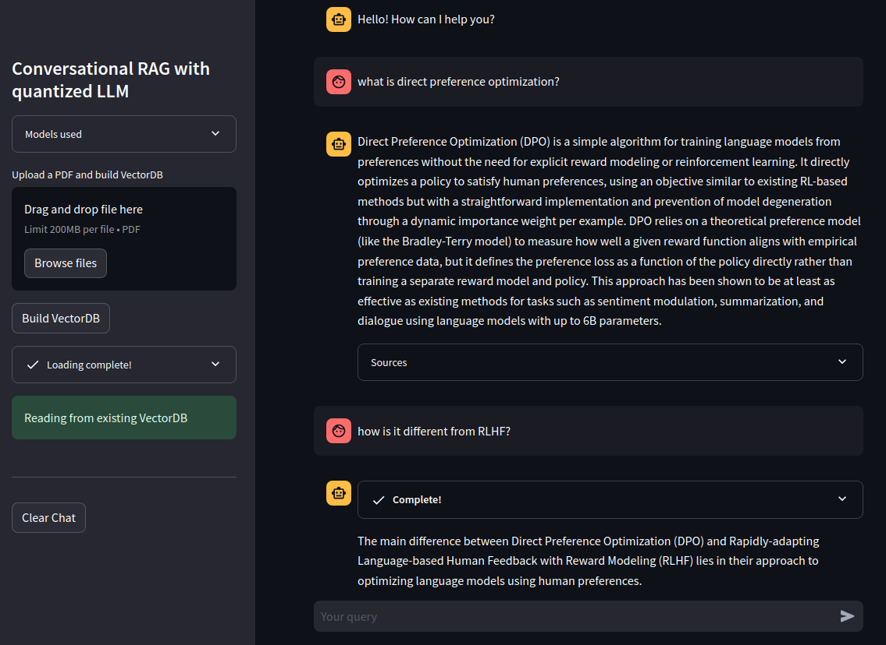

# retrieval-augmented-generation
Retrieval augmented generation (RAG) demos with Llama-2-7b, Mistral-7b, Zephyr-7b

The demos use quantized models and run on CPU with acceptable inference time. They can run **offline** without Internet access, thus allowing deployment in an air-gapped environment.

The demos also allow user to
- apply propositionizer to document chunks
- perform reranking upon retrieval
- perform hypothetical document embedding (HyDE)


## 🔧 Getting Started

You will need to set up your development environment using conda, which you can install [directly](https://docs.conda.io/projects/conda/en/latest/user-guide/install/index.html).

```bash
conda env create --name rag -f environment.yaml --force
```

Activate the environment.
```bash
conda activate rag
```

### Download model artefacts

Download and save the models in `./models` and update `config.yaml`. The models used in this demo are:
- Embeddings
    - [sentence-transformers/all-MiniLM-L6-v2](https://huggingface.co/sentence-transformers/all-MiniLM-L6-v2)
    - [BAAI/bge-small-en-v1.5](https://huggingface.co/BAAI/bge-small-en-v1.5)
- LLMs
    - [TheBloke/Llama-2-7B-Chat-GGUF](https://huggingface.co/TheBloke/Llama-2-7B-Chat-GGUF)
    - [TheBloke/Mistral-7B-Instruct-v0.2-GGUF](https://huggingface.co/TheBloke/Mistral-7B-Instruct-v0.2-GGUF)
    - [TheBloke/zephyr-7B-beta-GGUF](https://huggingface.co/TheBloke/zephyr-7B-beta-GGUF)
- Rerankers:
    - [facebook/tart-full-flan-t5-xl](https://huggingface.co/facebook/tart-full-flan-t5-xl): save in `models/tart-full-flan-t5-xl/`
    - [BAAI/bge-reranker-base](https://huggingface.co/BAAI/bge-reranker-base): save in `models/bge-reranker-base/`
- Propositionizer
    - [chentong00/propositionizer-wiki-flan-t5-large](https://huggingface.co/chentong00/propositionizer-wiki-flan-t5-large) save in `models/propositionizer-wiki-flan-t5-large/`


### Add prompt format

Since each model type has its own prompt format, include the format in `./src/prompt_templates.py`. For example, the format used in `openbuddy` models is
```python
_openbuddy_format = """{system}
User: {user}
Assistant:"""
```
Refer to the file for more details.


## 💻 App

We use Streamlit as the interface for the demos. There are two demos:
- RAG
```bash
streamlit run app.py
```

- Conversational RAG
```bash
streamlit run app_conv.py
```


## 🔍 Usage

To get started, upload a PDF and click on `Build VectorDB`. Creating vector DB will take a while.


